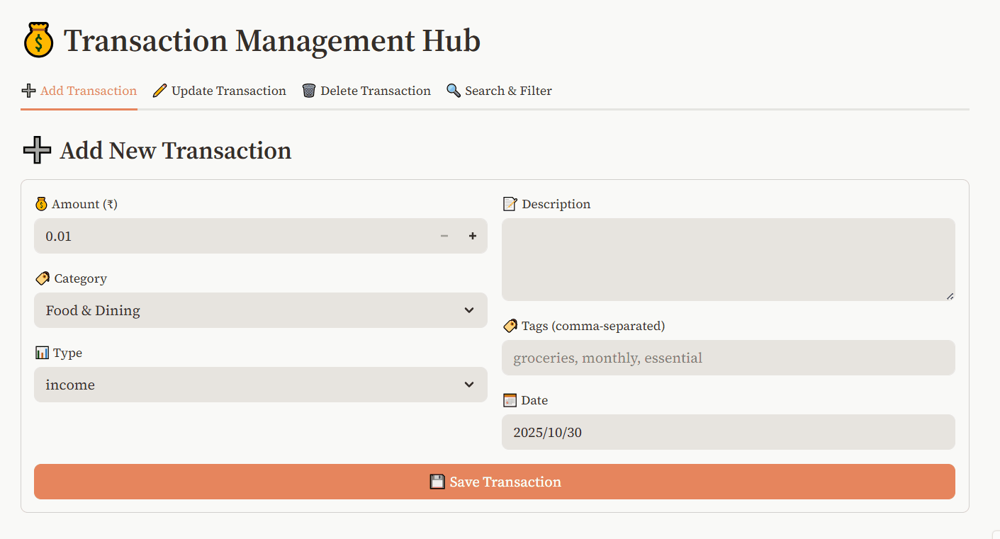
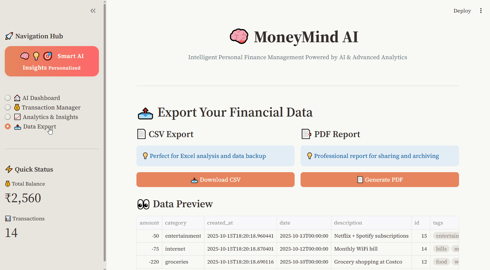

# 🧠💰 MoneyMind AI

<div align="center">
	


[](https://python.org)
[](https://flask.palletsprojects.com/)
[](https://streamlit.io/)
[](https://ai.google.dev/)
[](LICENSE)

**Your AI-Powered Personal Finance Dashboard**

*Built with Flask (backend) and Streamlit (frontend) featuring Google Gemini insights.*  
*Track expenses, visualize cash flow, and receive smart AI-based money advice.*

[🚀 Quick Start](#-quick-start) • [✨ Features](#-key-features) • [📸 Screenshots](#-screenshots) • [🔧 Tech Stack](#-technology-stack) • [📚 API Docs](#-api-documentation)

</div>

---

## 🎯 What is MoneyMind AI?

**MoneyMind AI** is an intelligent personal finance management platform that combines powerful backend APIs with a modern, AI-enhanced dashboard. Built for real-world use and designed to showcase end-to-end product development, this project demonstrates:

- 🧠 **AI-First Design** — Google Gemini integration for personalized financial insights
- 📊 **Interactive Analytics** — Real-time charts and visualizations with Plotly
- ⚡ **Rapid Prototyping** — Streamlit for production-grade UI without traditional frontend overhead
- 🏗️ **Scalable Architecture** — Clean separation between Flask REST API and frontend
- 💼 **Industry Practices** — Agile workflow, issue tracking and milestone releases

### Problem We Solve

Most people struggle with:
- ❌ Manual expense tracking and categorization
- ❌ Understanding spending patterns and financial health
- ❌ Making data-driven budgeting and investment decisions
- ❌ Lack of personalized, AI-powered financial advice

### Our Solution

✅ **Smart Transaction Management** — Automated tracking with AI categorization  
✅ **Conversational AI Advisor** — Ask questions, get personalized money advice  
✅ **Visual Analytics Dashboard** — Interactive charts for spending insights  
✅ **Real-Time Insights** — Instant calculations and trend analysis  
✅ **Export & Reporting** — Professional PDF/CSV reports

---

## 📸 Screenshots

### 🏠 AI Dashboard — Your Financial Command Center


<!-- Screenshot: Main dashboard showing metrics, AI chat, and charts -->

> **Highlights:** Real-time balance overview, AI-powered insights, interactive spending charts

---

### 💬 AI Financial Assistant — Ask Anything


> **Example queries:** "How can I reduce my expenses?" • "What's my spending pattern?" • "Am I on track for savings goals?"

---

### 💰 Transaction Management — Complete CRUD Interface


<!-- Screenshot: Transaction form and filterable table -->

> **Features:** Add/Edit/Delete transactions, real-time validation, advanced filtering

---

### 📈 Analytics & Insights — Deep Dive Into Your Money


<!-- Screenshot: Multiple charts - pie chart, timeline, treemap -->

> **Visual Tools:** Category breakdown, monthly trends, spending heatmaps, AI pattern analysis

---

### 📥 Export Data & Reports

---

## ✨ Key Features

### 🧠 AI-Powered Intelligence

- **Conversational AI Advisor** powered by Google Gemini
- **Natural Language Queries** — Ask financial questions in plain English
- **Personalized Recommendations** — Smart tips based on your spending patterns
- **Pattern Recognition** — AI identifies concerning trends and opportunities
- **Goal Setting Assistant** — Get realistic financial goal recommendations

### 📊 Modern Dashboard UI (Streamlit)

- **Responsive Design** — Works seamlessly on desktop, tablet, and mobile
- **Interactive Charts** — Plotly-powered visualizations with zoom, filter, and export
- **Real-Time Updates** — Live metrics refresh on data changes
- **Custom Theming** — Professional gradient design with customizable colors
- **Tabbed Navigation** — Organized layout for Dashboard, Transactions, Analytics, Export

### 💰 Transaction Management

- **Full CRUD Operations** — Create, Read, Update, Delete with persistent SQLite storage
- **Smart Categorization** — Pre-defined categories (Food, Transport, Healthcare, etc.)
- **Transaction Types** — Income, Expense, Investment, Transfer
- **Advanced Filtering** — Search by date range, category, type, or keywords
- **Batch Operations** — Export multiple records to CSV/PDF

### 📈 Financial Analytics

- **Summary Metrics** — Total income, expenses, net balance, transaction count
- **Category Breakdown** — Pie charts and treemaps for spending distribution
- **Time-Series Analysis** — Monthly/quarterly trend lines and forecasting
- **Comparative Views** — Income vs. Expense tracking over time
- **Delta Indicators** — Visual cues for spending increases/decreases

### 🔐 Professional Backend (Flask REST API)

- **RESTful Design** — Standard HTTP methods and status codes
- **JSON API** — Consistent response format with success/error handling
- **Input Validation** — Comprehensive sanitization and business rule enforcement
- **Error Handling** — Detailed error messages for debugging
- **Health Monitoring** — Service health check endpoints
- **Database Migrations** — Alembic for schema version control

---

## 🏗️ Technology Stack

### Frontend
- **[Streamlit](https://streamlit.io/)** — Rapid UI development with Python
- **[Plotly](https://plotly.com/python/)** — Interactive data visualizations
- **Custom CSS** — Tailored theming for professional fintech look

### Backend
- **[Flask 3.0](https://flask.palletsprojects.com/)** — Lightweight Python web framework
- **[SQLAlchemy](https://www.sqlalchemy.org/)** — ORM for database management
- **[Flask-Migrate](https://flask-migrate.readthedocs.io/)** — Database migration handling
- **SQLite** — Embedded database (easily swappable to PostgreSQL/MySQL)

### AI Integration
- **[Google Gemini API](https://ai.google.dev/)** — Advanced language model for financial insights
- **Prompt Engineering** — Context-aware AI responses tailored to Indian financial context

---

## 🚀 Quick Start

### Prerequisites

- **Python 3.12+** — [Download Python](https://python.org)
- **Git** — [Download Git](https://git-scm.com/)
- **Google Gemini API Key** — [Get API Key](https://ai.google.dev/)

### Installation

```bash
# 1. Clone the repository
git clone https://github.com/sumegh26/FinanceAI-Advisor.git
cd FinanceAI-Advisor

# 2. Create and activate virtual environment
python -m venv venv

# Windows
venv\Scripts\activate
# macOS/Linux
source venv/bin/activate

# 3. Install dependencies
pip install -r requirements.txt

# 4. Set up environment variables
cp .env.example .env
# Edit .env with your configuration:
# - Add your GOOGLE_API_KEY for Gemini AI
# - Configure Flask settings if needed

# 5. Initialize database
set FLASK_APP=run.py  # Windows
export FLASK_APP=run.py  # macOS/Linux
flask db upgrade

# 6. Run the Flask backend (Terminal 1)
python run.py
# Backend will run on http://127.0.0.1:5000

# 7. Run the Streamlit frontend (Terminal 2 - new terminal window)
cd frontend
streamlit run finance_ui.py
# Frontend will run on http://localhost:8501
```

### Environment Variables

Create a `.env` file in the project root:

```env
# Flask Configuration
FLASK_APP=run.py
FLASK_ENV=development
SECRET_KEY=your-secret-key-here

# Database
DATABASE_URL=sqlite:///instance/financeai.db

# Google Gemini AI
GOOGLE_API_KEY=your-gemini-api-key-here

# Streamlit (optional)
STREAMLIT_SERVER_PORT=8501
```

### Verification

1. **Test Backend API:**
```bash
curl http://127.0.0.1:5000/health
# Expected: {"status": "healthy", "message": "API is running"}
```

2. **Access Frontend:**
   - Open browser to `http://localhost:8501`
   - You should see the MoneyMind AI dashboard

3. **Run Tests:**
```bash
pytest tests/ -v
```

---

## 📚 API Documentation

### Base Configuration

- **Base URL:** `http://127.0.0.1:5000/api/v1`
- **Content-Type:** `application/json`
- **Response Format:** JSON with consistent structure

### Standard Response Format

```json
{
    "success": true,
    "data": { ... },
    "message": "Operation completed successfully",
    "errors": []  // Only present on validation failures
}
```

### Endpoints Overview

| Method | Endpoint | Description |
|--------|----------|-------------|
| GET | `/health` | Health check |
| GET | `/api/v1/transactions` | List all transactions (supports filtering) |
| POST | `/api/v1/transactions` | Create new transaction |
| GET | `/api/v1/transactions/{id}` | Get specific transaction |
| PUT | `/api/v1/transactions/{id}` | Update transaction |
| DELETE | `/api/v1/transactions/{id}` | Delete transaction |
| GET | `/api/v1/transactions/summary` | Financial summary with analytics |
| GET | `/api/v1/transactions/export` | Export data (CSV/PDF) |

### Example: Create Transaction

**Request:**
```bash
curl -X POST http://127.0.0.1:5000/api/v1/transactions \
  -H "Content-Type: application/json" \
  -d '{
    "amount": 2500.00,
    "category": "Salary",
    "description": "Monthly salary payment",
    "transaction_type": "income",
    "date": "2025-10-30T10:30:00",
    "tags": ["work", "monthly"]
  }'
```

**Response:**
```json
{
    "success": true,
    "data": {
        "id": 1,
        "amount": 2500.0,
        "category": "Salary",
        "description": "Monthly salary payment",
        "transaction_type": "income",
        "date": "2025-10-30T10:30:00",
        "created_at": "2025-10-30T10:30:15.123456",
        "tags": ["work", "monthly"]
    },
    "message": "Transaction created successfully"
}
```

### Query Parameters for Filtering

| Parameter | Type | Description | Example |
|-----------|------|-------------|---------|
| `category` | string | Filter by category | `?category=Food` |
| `transaction_type` | string | income/expense/investment/transfer | `?transaction_type=expense` |
| `start_date` | ISO date | Filter from date | `?start_date=2025-10-01` |
| `end_date` | ISO date | Filter to date | `?end_date=2025-10-31` |

### Error Handling

```json
{
    "success": false,
    "error": "Validation failed",
    "message": "Invalid transaction data",
    "details": [
        "'amount' is required",
        "'transaction_type' must be one of: income, expense, investment, transfer"
    ]
}
```

**[📖 Full API Documentation →](./docs/API.md)**

---

## 🏗️ Project Architecture

### System Design

```
┌─────────────────────────────────────────────────────────────┐
│                    Streamlit Frontend                        │
│  (finance_ui.py - Dashboard, Forms, Charts, AI Interface)   │
└────────────────────┬────────────────────────────────────────┘
                     │ HTTP/REST API Calls
                     ▼
┌─────────────────────────────────────────────────────────────┐
│                    Flask Backend API                         │
│         (routes.py - Business Logic & Endpoints)            │
└────────────────────┬────────────────────────────────────────┘
                     │
        ┌────────────┴──────────────┬──────────────────┐
        ▼                           ▼                  ▼
┌──────────────────┐    ┌──────────────────┐   ┌─────────────┐
│   SQLAlchemy ORM │    │  Google Gemini   │   │ Validators  │
│   (models/)      │    │      API         │   │  (utils/)   │
└────────┬─────────┘    └──────────────────┘   └─────────────┘
         ▼
┌──────────────────┐
│   SQLite DB      │
│ (financeai.db)   │
└──────────────────┘
```

### Directory Structure

```
MoneyMind-AI/
├── app/                        # Backend application package
│   ├── __init__.py             # Flask app factory
│   ├── api/
│   │   ├── __init__.py         # Blueprint registration
│   │   └── routes.py           # REST API endpoints
│   ├── models/
│   │   └── transaction.py      # SQLAlchemy models
│   ├── utils/
│   │   ├── validators.py       # Input validation
│   │   ├── response.py         # Response formatters
│   │   └── logger.py           # Logging configuration
│   │   ├── exceptions.py       # Custom exception
│   └── extensions.py           # Flask extensions (DB, Migrate)
│
├── frontend/                   # Streamlit UI
│   ├── finance_ui.py           # Main Streamlit app
│   ├── .streamlit/
│   │   └── config.toml         # Theme configuration
│   ├── assets/
│   │   └── icon.png            # Icon
│   │   └── logo.png            # Logo
│   └── .env                    # Frontend environment vars
│
├── tests/                      # Test suite
│   ├── test_api.py             # API endpoint tests
│   └── test_models.py          # Model validation tests
│
├── migrations/                 # Alembic database migrations
│   └── versions/               # Migration scripts
│
├── instance/                   # Instance-specific files
│   └── financeai.db            # SQLite database
│
├── assets/                     # Media assets
│   ├── banner.png              # README banner
│   └── screenshots/            # App screenshots
│
├── .env                        # Environment variables (backend)
├── .gitignore                  # Git ignore rules
├── requirements.txt            # Python dependencies
├── run.py                      # Application entry point
└── README.md                   # This file
```

---

## 🎨 UI/UX Highlights

### Design Philosophy

MoneyMind AI follows modern fintech design patterns inspired by industry leaders like Stripe, Plaid, and Anthropic:

- **Clean Typography** — Sans-serif fonts with clear hierarchy
- **Contextual Colors** — Green for positive (income), red for negative (expenses)
- **Responsive Layout** — Grid system adapts to screen size
- **Accessibility** — High contrast ratios and semantic HTML

### Custom Theming

Edit `.streamlit/config.toml` to customize colors:

```toml
[theme]
base = "dark"
primaryColor = "#00D9FF"
backgroundColor = "#0E1117"
secondaryBackgroundColor = "#1E2530"
textColor = "#FAFAFA"
font = "sans serif"
```

**Pro Tip:** Check out streamlit [theme examples](https://doc-theming-overview-anthropic-light-inspired.streamlit.app/) for Anthropic-light, Spotify-dark,etc

---

## 🗺️ Roadmap & Future Enhancements

### ✅ Completed (v1.0)
- [x] Flask REST API with CRUD operations
- [x] SQLite database with migrations
- [x] Streamlit dashboard with AI chat
- [x] Google Gemini integration
- [x] Interactive Plotly charts
- [x] Transaction filtering and search
- [x] CSV/PDF export functionality
- [x] Custom theming and responsive design

### 🔜 Coming Soon (v1.1)
- [ ] **LangChain Integration** — Advanced AI agent workflows
- [ ] **Multi-user Support** — User authentication and authorization
- [ ] **Recurring Transactions** — Automated transaction scheduling
- [ ] **Budget Goals** — Set and track spending limits per category


### 🌟 Long-term Vision (v2.0+)
- [ ] **Predictive Analytics** — ML models for spending forecasts
- [ ] **Investment Tracking** — Stock/crypto portfolio integration
- [ ] **Bill Reminders** — Smart notifications for upcoming payments
- [ ] **Tax Reports** — Automated tax-ready financial statements
- [ ] **Multi-currency Support** — International transaction handling
- [ ] **Collaborative Budgets** — Shared accounts for families/teams

**[🎯 View Full Roadmap →](https://github.com/sumegh26/FinanceAI-Advisor/projects)**

---

## 🤝 Contributing

We welcome contributions! This project follows industry-standard agile practices:

### Development Workflow

1. **Fork & Clone** the repository
2. **Create a feature branch** from `develop`:
   ```bash
   git checkout -b feature/your-feature-name develop
   ```
3. **Make changes** and commit with clear messages:
   ```bash
   git commit -m "feat: Add AI-powered budget recommendations"
   ```
4. **Write tests** for new features
5. **Submit a Pull Request** to the `develop` branch

### Branching Strategy

```
main         ← Stable releases only
  └─ develop ← Active development
       ├─ feature/ai-enhancements
       ├─ feature/OCR-enhancements
       └─ bugfix/validation-error
```

**[📖 Full Contributing Guide →](./CONTRIBUTING.md)**

---

## 📄 License

This project is licensed under the **MIT License** - see the [LICENSE](LICENSE) file for details.

---

## 🙏 Acknowledgments

- **Google Gemini** — AI-powered insights
- **Streamlit Team** — Amazing rapid prototyping framework
- **Flask Community** — Robust web framework
- **Plotly** — Interactive visualization library
- **Open Source Community** — For countless helpful libraries

---

## 📞 Contact & Support

<div align="center">

**Built with ❤️ by [Sumegh](https://github.com/sumegh26)**

[](https://github.com/sumegh26)
[](https://www.linkedin.com/in/sumeghthale/)


---

### ⭐ If you find this project useful, please star the repository!

**[🚀 Quick Start](#-quick-start) • [📸 View Demo](#-screenshots) • [🤝 Contribute](#-contributing) • [⭐ Star on GitHub](https://github.com/sumegh26/FinanceAI-Advisor)**

---

*Last Updated: November 2025 | Version 1.0.0*

</div>